# Portafolio Proyecto Integrador
## Carolina Fortmann - Programación de Plataformas Web 


## Proceso de desarrollo

Para la creación de este proyecto se utilizó Visual Studio Code para implementar Angular en una carpeta, en este caso *icc-ppw-proyecto-int-fortmann*. Dentro de esta carpeta se verifica que Angular este instalado, para posteriormente crear la subcarpeta *ppw-angular-portfolio*, la cual usa **pnpm**. Por último se instala la librería de **TailWind CSS** para poder implementar el diseño del portafolio de manera más sencilla.

Dentro de ```/app``` fueron creadas las subcarpetas necesarias para este proyecto:

* **Components:** Almacena los componentes header, hero y footer.

* **Core:** Para las interfaces y servicios.

* **Features:** Donde se encuentran la mayoría del proyecto, como el auth, projectos, home, programadores y las solicitudes.

Para la conexión con FireBase se instaló con los comandos necesarios la última versión compatible de FireBase en el proyecto. A su vez se inició sesión para poder conectarnos con la misma cuenta de google con la que tenemos un nuevo proyecto en la página de FireBase.

* **Authenticacion:** Se habilita para que el usuario pueda ingresar con correo o por su cuenta de google. En la imagen se observa el ingreso y la cuenta de google del programador de este proyecto.

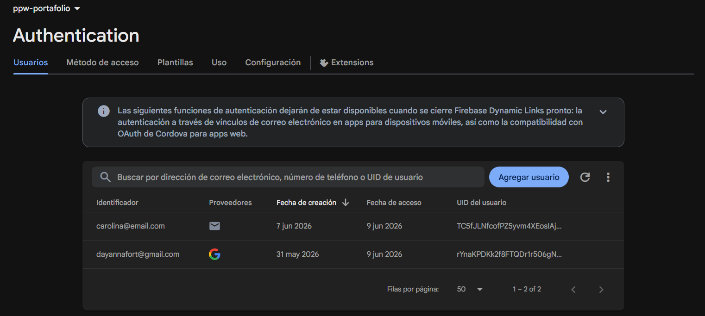

* **FireStore:** Se habilita esta base de datos para almacenar las solicitudes. Esta práctica permitirá guardar, extraer y editar datos.

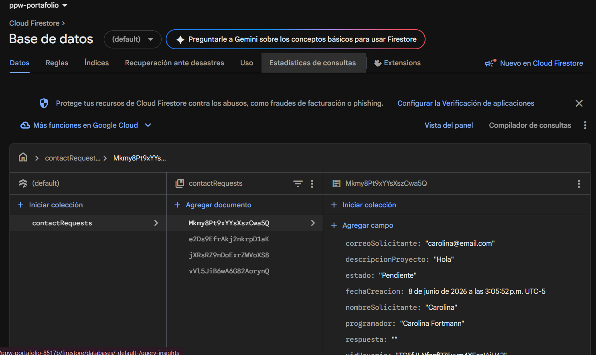


Para consumir recursos desde Strapi CMS, se tuvo que instalar en una nueva carpeta dentro de la ruta de la carpeta principal del proyecto. Strapi CMS abre su propio localhost con el comando ```pnpm develop``` donde se crea una cuenta.

Se crean cada content-type, los cuales son como los objetos que contienen la información que después consumamos desde angular. Por ejemplo, primero Programador y sus atributos:

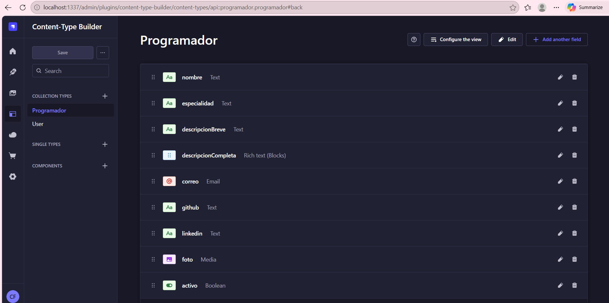

Una vez creados todos los content-type y añadir entradas, se puede observar en el HomePage de Strapi Cloud el registro de estos:

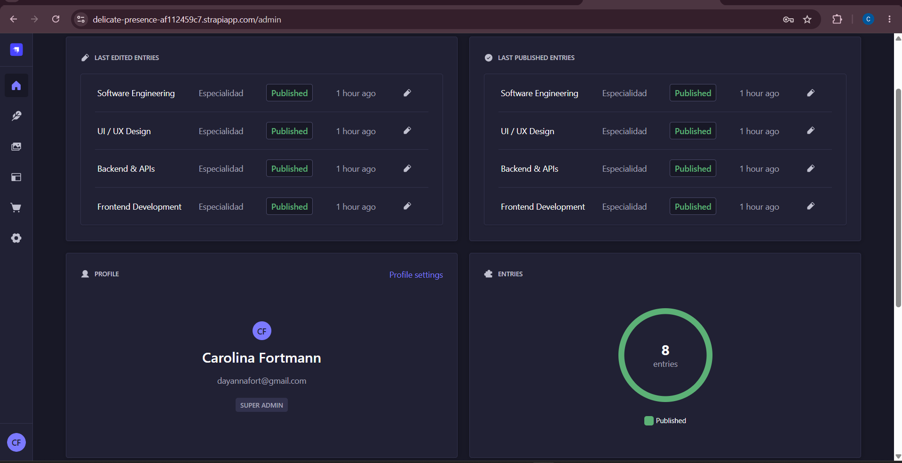

Strapi CMS es bastante útil para manejar los datos de nuestra página web de manera independiente. Se pueden realizar cualquier cambio/ actualización desde ahi y nuestra página los mostrará inmediatamente.

## Vista del HomePage

La interfaz muestra la página principal del portafolio, con 3 botones:

* **Proyectos destacados:** Navega hacia abajo en la misma página, es decir, a la sección.

* **Contacto:** Hace la misma función que el botón anterior, solo que al apartado de contacto.

* **Ver perfil completo:** Al contrario este botón navega a ```/developers```. Cumple la misma función que *Perfil/ del Navbar.

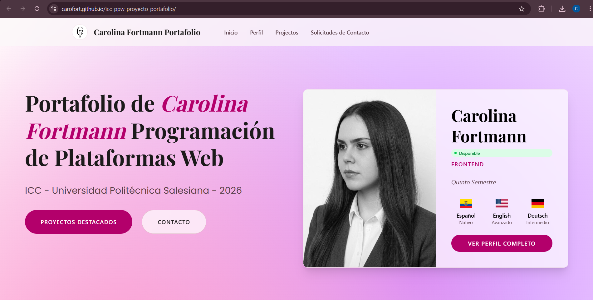

Al scrollear hacia abajo, continua la sección de especialidades con 4 cards obtenidas a través de Strapi. Estas son customizables, es decir, al añadir un nuevo elemento en Strapi, a su vez se genera una card más.

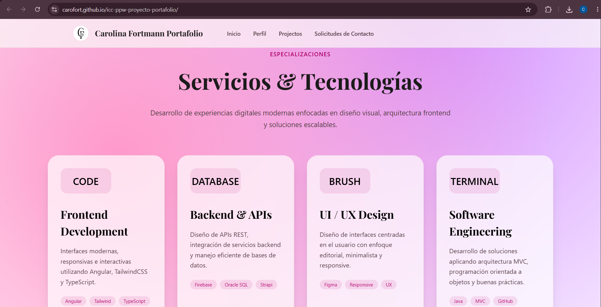

La sección de proyectos destacados muestra 2 proyectos obtenidos de la API de proyectos en Strapi. Tiene varios botones que nos redirigen a ```/projects``` para poder ver más a detalle cada uno.

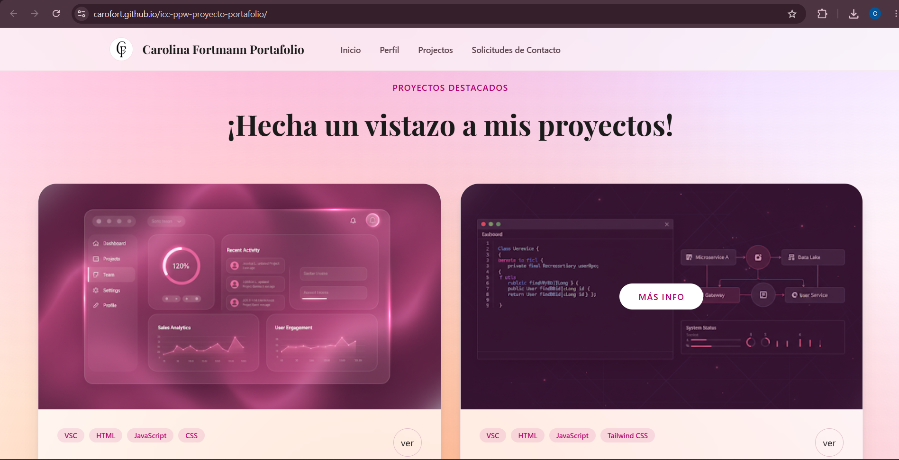

La útlima sección del HomePage es la de contacto. Esta contiene una imagen y un card que contiene un botón que nos redirigue a ```/auth``` en caso de no haber iniciado sesión aún.

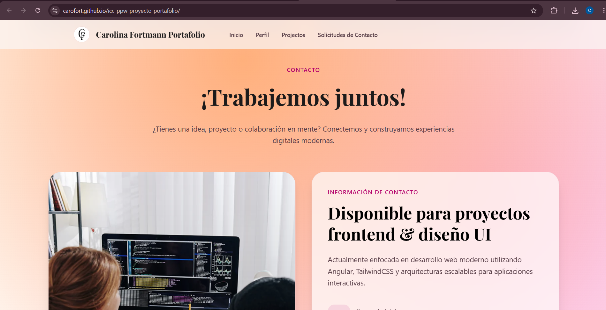

Esta imagen solo muestra el botón y el diseño del footer con 3 funciones:

* Enlace directo a Linkedin, GitHub y una opción para escribir un correo directamente al programador.

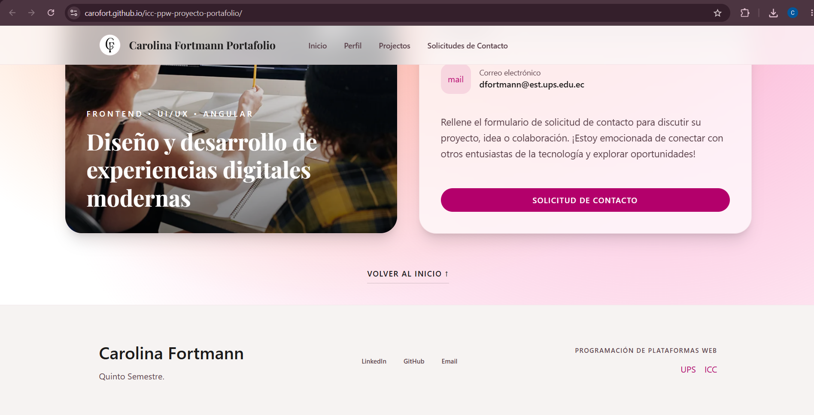

## Decisiones de diseño

En orden para crear una UI que sea llamativa y cohesiva, busqué diversos diseños previamente creados por otros programadores para tomar como inspiración.
La interfaz que más me gustó es la siguiente, ya que es bastante sencilla y no tiene mucha carga cognitiva:


Tras haber encontrado la referencia para mi portafolio, continué con la creación de este mismo diseño implementando el uso de Stitch AI como ayuda para la creación del HTML. La IA me devolvió la idea que aparece en la imagen:

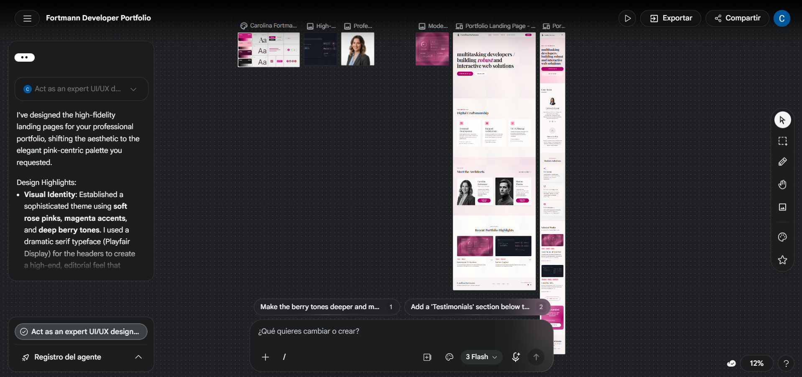

Una vez obtenida la base de mi interfaz, procedí a realizar cambios en el degradado. En ```styles.css``` se encuentra una clase ```mesh-gradient``` la cual predomina en todas mis rutas como el fondo predeterminado, suele cambiar.

### NavBar

Revisé otros portafolios y la gran mayoría no tenía implementado un Navbar con botones como yo lo tengo. Decidí aún así dejarlo en mi portafolio, porque siento que es más práctico para el usuario tener los botones a mano, como si fuera de acceso rápido.


## Desafíos enfrentados

Como cualquier proyecto, este también tuvo diversas complicaciones durante el desarrollo.

### 1.- RouterLinks

Al inicio de la creación del proyecto, al tener bastantes subcarpetas como las de /features, se produjo un error en el ```app.routes.ts``` lo cual me dejaba la página en el localhost completamente blanca. Cuando ocurre esto es muy complicado encontrar donde está la falla incluso si hacemos **F12**. Este problema me sucedió en otra carpeta, tuve que realizar *Ctrl + Z* hasta llegar a la raíz.

### 2.- FireBase

A pesar de ser sencilla la configuración del Firebase, dentro de ```app.config.ts``` yo había copiado unas constantes que aparecían en la página de FireBase. Estas constantes aparecían debajo de ```const firebaseConfig = {};```, los cuales causaron confusión y al pegarlos, la página se volvió completamente blanca.

``` bash
// Initialize Firebase
const app = initializeApp(firebaseConfig);
const analytics = getAnalytics(app);
```

### 3.- FireStore

A la hora de almacenar y recolectar solicitudes, la base de datos de FireStore era totalmente nueva para mí. Tuve complicaciones para guardar las claves primarias (UIDs) y para recolectarlas siempre tenía errores en la Consola. También a la hora de cambiar el estado de una solicitud y que se le actualice al usuario de manera inmediata. 

Al ser todo completamente dependiente de lo otro, fue bastante complicado hacer que todo funcione correctamente, es decir, de manera fluida.

### 4.- Strapi CMS

Como realice la interfaz con ayuda de Stitch AI y agregué yo misma desde los HTMLs la información de todo mi UI, la implementación de Strapi CMS fue bastante tediosa. 
Todos los recursos deben de ser consumidos a través de la API generada en Strapi, ya sea el nombre, imagen, especialidades, etc...
Este cambio tomó más tiempo del esperado, lo cual me dejó claro que debí haber configurado Strapi desde un inicio.

### 5.- Despliegue y Strapi Cloud

Probé realizar el despliegue de mi portafolio a través de FireBase Hosting y este tenía bastantes problemas. Mi solución fue implementar Github Pages. Con este no obtuve muchos problemas, el único fue el cambio de la URL de la API de Strapi, ya que tuve que subirlo a Strapi Cloud. Este cambio borró los elementos que ya había dentro de Collection Types, me tocó volver a añadir las entradas que yo ya tenía en mi localhost.

## Despliegue de la página

**Página desplegada en Github Pages:**

https://carofort.github.io/icc-ppw-proyecto-portafolio/home

**Strapi Cloud:**

https://delicate-presence-af112459c7.strapiapp.com/admin

**Repositorio de Strapi:**

https://github.com/Carofort/icc-ppw-proyecto-strapi


Cada nueva actualización en angular, se deberá ejecutar los siguientes comandos para que Github Pages también se actualice: 

```bash
pnpm ng build --base-href "/icc-ppw-proyecto-portafolio/"       

npx angular-cli-ghpages --dir=dist/ppw-angular-portfolio/browser
```

## Guía de funcionamiento
### Usuarios

Un usuario puede navegar a través del portafolio con total libertad, es decir, puede acceder y visualizar:

* La HomePage completa

* Perfil del programador

* Los proyectos que ha realizado el programador

Pero su limitante es realizar la solicitud para poder contactarse con el programador. Para realizar esta acción el usuario debe registrarse o iniciar sesión para poder llevar un registro en el FireBase. Al hacer clic en *Solicitudes de Contacto* en el Navbar, este redirecciona a ```/auth```:

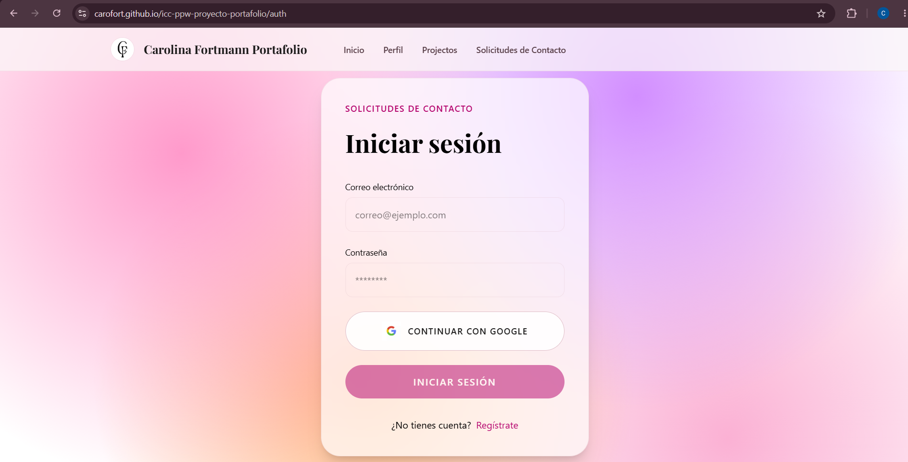

Una vez el usuario inicia sesión o se registra, la página lo redirecciona a ```/contact-requests``` para ingresar información al formulario, el cual se almacenará en el FireStore cuando se haga clic en el botón de enviar.

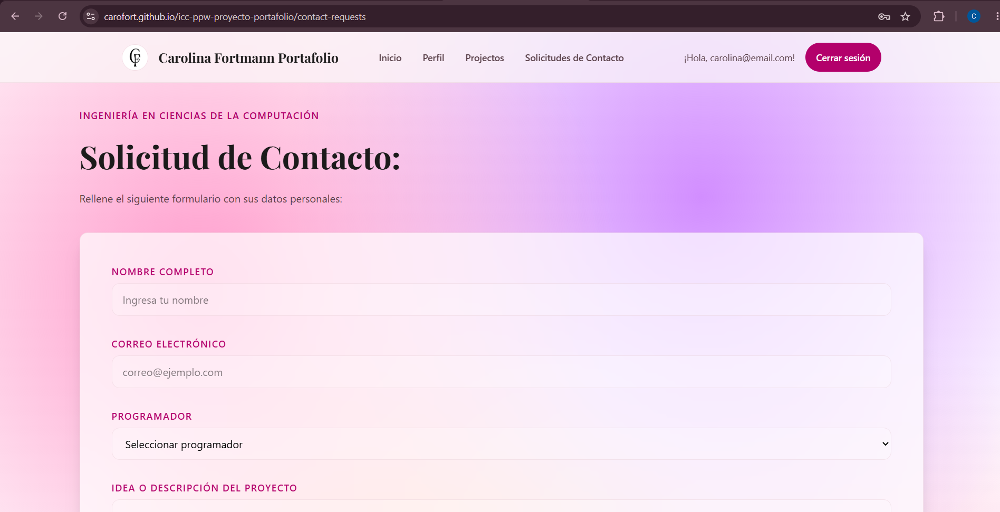

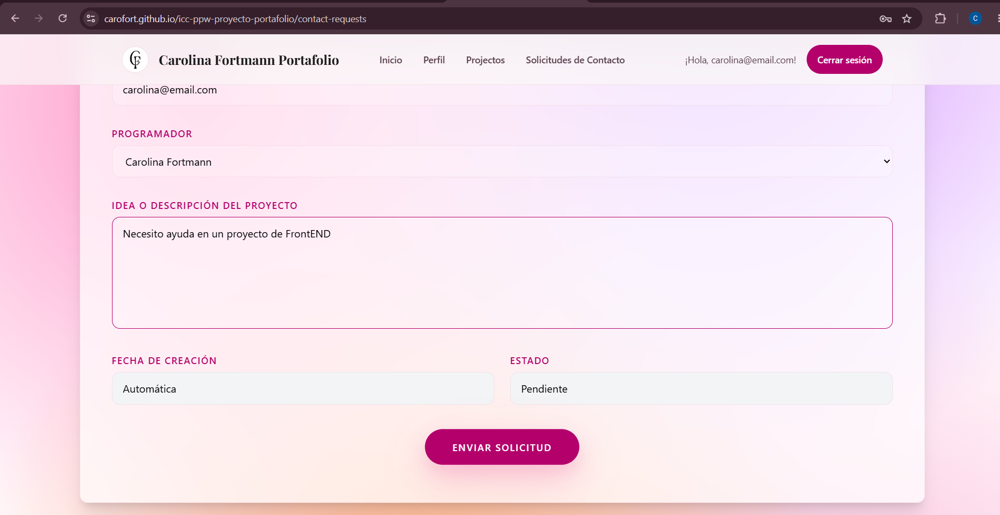


Además en la parte inferior del formulario, el usuario podrá observar todas las solicitudes previamente enviadas.

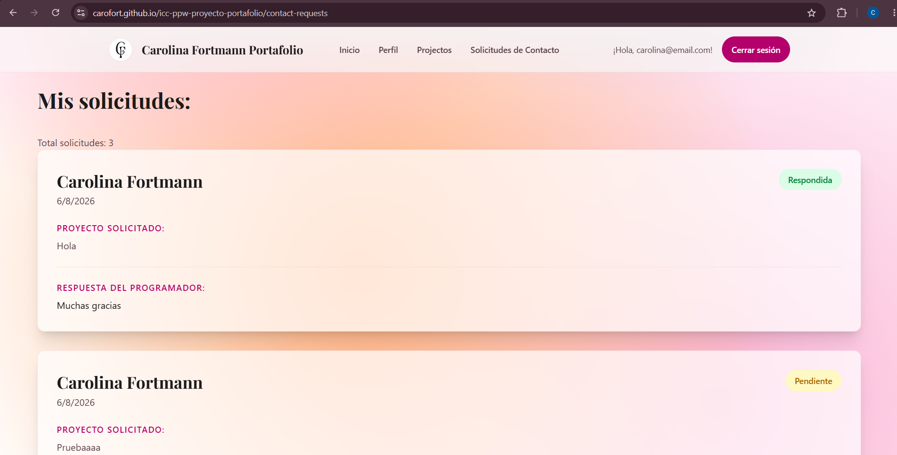

Verificación en el FireStore:

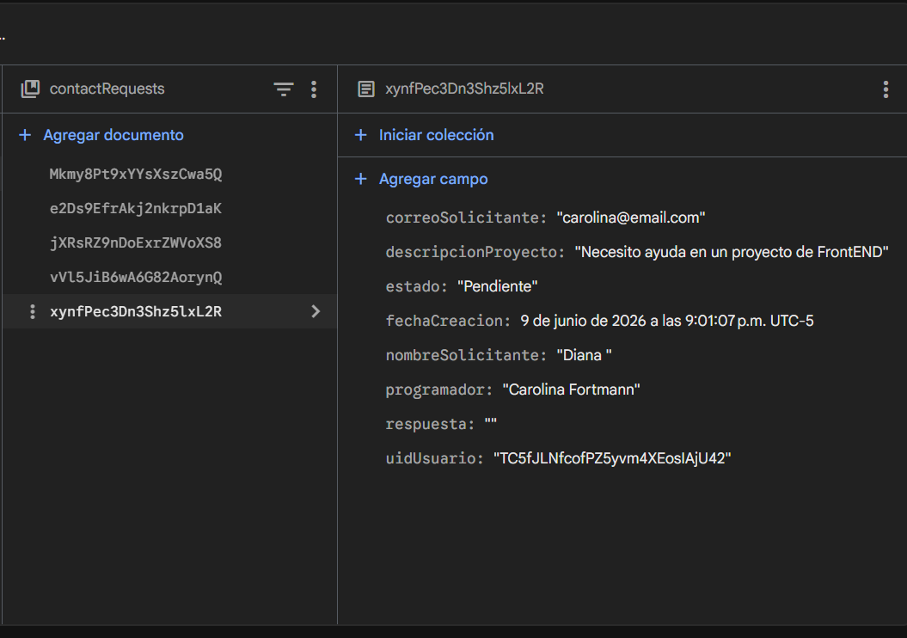

### Administradores

Cuando se inicia sesión con el correo almacenado como programador, la página se redirige a ```/admin-requests```. Aqui el administrador/ programador va a poder leer las solicitudes de los usuarios. 

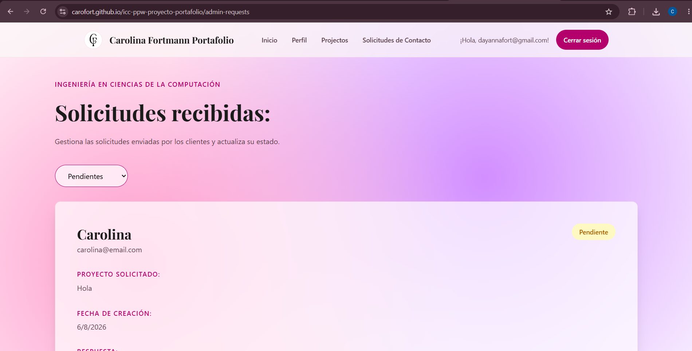

De la misma manera, el programador puede responder en un campo de texto a la solicitud del usuario. El botón se habilita cuando se empieza a escribir.

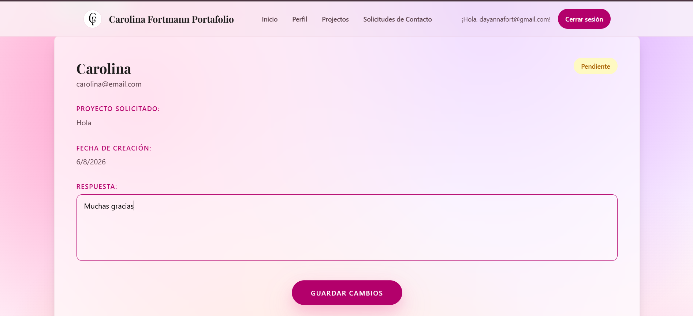

Al presionar el botón de enviar, automáticamente se cambia el estado de la solicitud a *Respondida* y en usuario podrá ver la respuesta del programador. 
Esto se puede verificar en el FireStore:

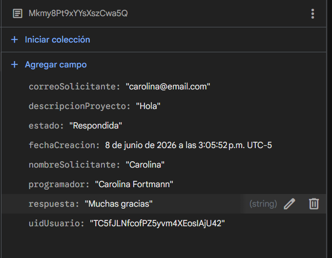

